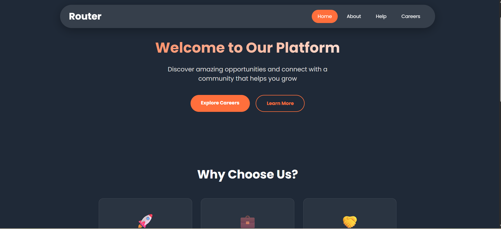

# React Router Practice App

A modern React application built to practice React Router concepts with an updated UI design featuring a floating navbar and contemporary styling.



## 🎯 Project Overview

This is a practice project focused on implementing React Router with multiple routes, nested routing, and modern UI design patterns. The application features a floating navigation bar, breadcrumb navigation, and a professional multi-page layout.

## ✨ Features

- **Floating Navigation Bar** - Modern glassmorphism navbar with active state indicators
- **Multiple Routes** - Home, About, Help, and Careers pages
- **Nested Routing** - Help section with FAQ and Contact pages
- **Modern UI Design** - Contemporary color scheme with smooth animations
- **Responsive Layout** - Mobile-friendly design that works on all devices
- **JSON Server Integration** - Mock backend API for career listings

## 🚀 Getting Started

1. Clone the repository

```bash
git clone <your-repo-url>
cd routerApp
```

2. Install dependencies

```bash
npm install
```

## 🏃‍♂️ Running the Application

### Start the React Development Server

```bash
npm start
```

The app will open at [http://localhost:3000](http://localhost:3000)

### Start the JSON Server (Backend)

In a **separate terminal**, run:

```bash
json-server --watch data/db.json --port 4000
```

The mock API will be available at [http://localhost:4000](http://localhost:4000)

## 🎨 Design Features

- Floating navbar with backdrop blur effect
- Interactive card layouts
- Hover animations and transitions
- Responsive grid systems
- Modern glassmorphism effects

## 🛠️ Technologies Used

- **React** - Frontend framework
- **React Router** - Client-side routing
- **JSON Server** - Mock REST API
- **CSS3** - Custom styling and animations

## 🔧 Development Scripts

```bash
# Start development server
npm start


# Start JSON server
json-server --watch data/db.json --port 4000
```

## 🚀 Future updates

- Add Tailwind CSS
- Include Backend

## 📄 License

This project is open source and available for educational purposes.

## 🙏 Acknowledgments

- Built with Create React App
- Routing powered by React Router
- Mock API by JSON Server
